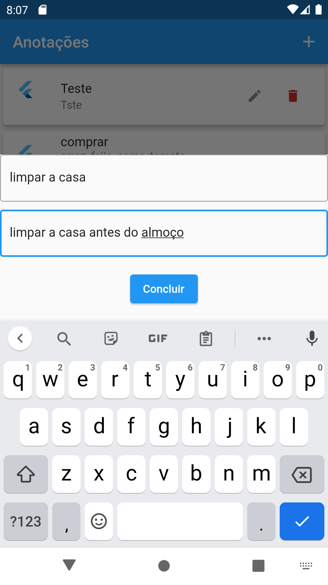
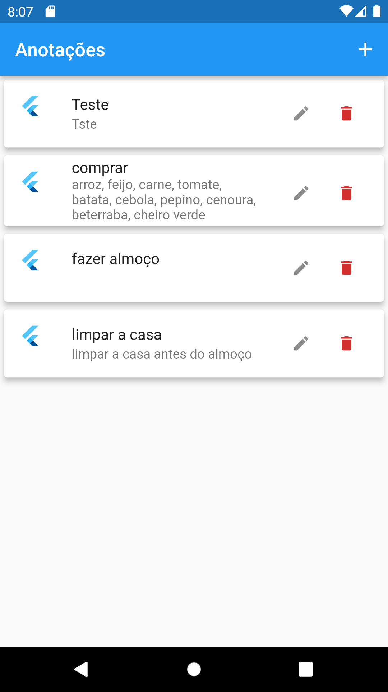
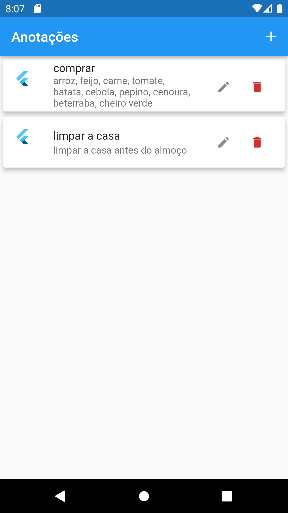

# app_anotacoes

🚧Projeto ainda em construção🚧

Falta aplicar banco de dados para o app salvar os dados quando fecha e melhorar o excluir e editar

<h2>Lista de Anotações</h2>

<h2>Titulo e Subtitulo da Anotação</h2>

<h2>Anotação adicionada</h2>

<h2>Anotações removidas</h2>

